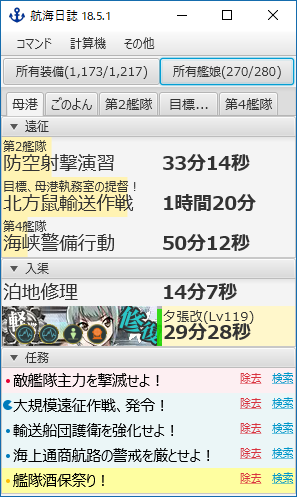
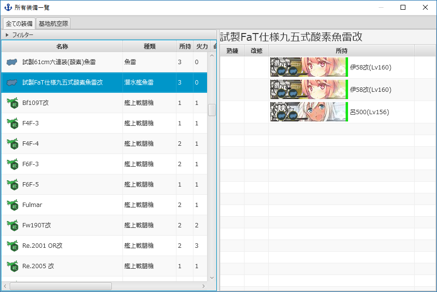
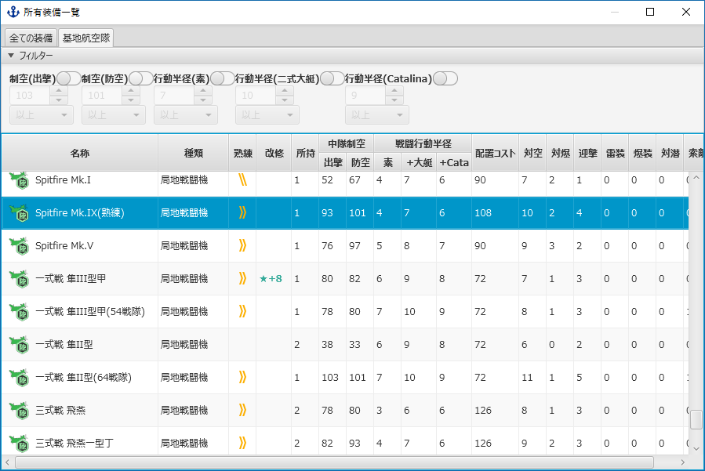
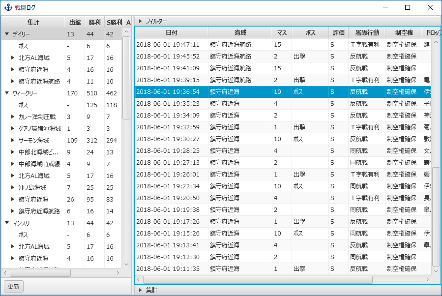
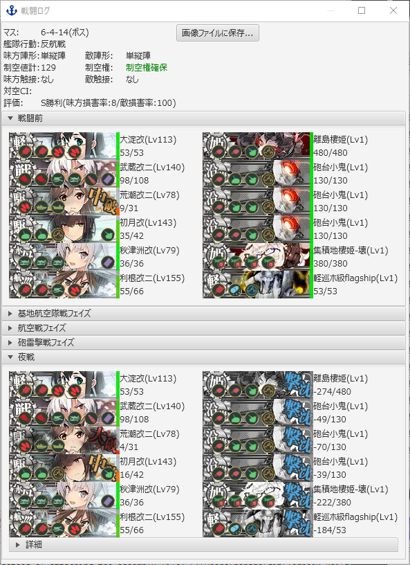

航海日誌 (logbook-kai)
--

**航海日誌 (logbook-kai)** は、「艦隊これくしょん ～艦これ～」をより遊びやすくするための外部ツールです。

画面がコンパクトなのが特徴です。

### 航海日誌 について

航海日誌 では[Jetty](http://www.eclipse.org/jetty/) で通信内容をキャプチャして内容を解析／表示します。
プロキシ設定を行うことで別のツールと連携することも可能です。

**「艦隊これくしょん ～艦これ～」サーバーに対する通信内容の改変、追加の通信等は一切行っていません。**

MIT ライセンスの下で公開する、自由ソフトウェアです。

### 主な機能

* 遠征・入渠の通知機能 : 1分前になると自動的に通知します。
* 海戦・ドロップ報告書 : 戦闘の状況、ドロップ艦娘などの情報の収集を行えます。
* 所有装備一覧 : 誰がどの装備を持っているかを簡単に確認することが出来ます。
* 所有艦娘一覧 : 艦娘の各種パラメータ(コンディション、制空値、火力値等)の閲覧を行うことが出来ます。
* お風呂に入りたい艦娘 : 修理が必要な艦娘の時間と必要資材を一覧で見ることが出来ます。

### [ダウンロード](https://github.com/sanaehirotaka/logbook-kai/releases)

**ご注意ください**

**初期の状態では艦娘の画像が表示出来ません。必ず**[FAQ](faq.md)**をお読みください。**

#### プラグイン
* [Pushbullet Plugin](https://github.com/rsky/logbook-kai-plugins)
 * 遠征・入渠の通知をiPhone/Android端末へプッシュ通知することが可能になります。

### [ブラウザの設定(必須)](how-to-preference.md)

### 動作環境

Java 8u40以降のJava8がインストールされた環境で動作します
**互換性の問題のため、Java9以降では動作しません。**

* Windows 7 以降
* Linux
* MacOS

次のJavaVMで動作確認されています。

- [Amazon Corretto 8](https://aws.amazon.com/jp/corretto/)
   - [Amazon Corretto 8のインストール方法](https://docs.aws.amazon.com/ja_jp/corretto/latest/corretto-8-ug/windows-7-install.html)
- [Oracle JDK 8](https://www.oracle.com/technetwork/java/javase/downloads/jdk8-downloads-2133151.html)
   - 要OTNアカウント

### [FAQ](faq.md)

### スクリーンショット

* メイン画面

* 所有装備一覧

* 戦闘ログ

### 開発者向け

#### [ビルド方法](how-to-build.md)

#### [プラグイン開発](how-to-develop.md)

### ライセンス

* [The MIT License (MIT)](LICENSE)

MIT ライセンスの下で公開する、自由ソフトウェアです。

### 使用ライブラリとライセンス

以下のライブラリを使用しています。

#### [JSON Processing(JSR 353)](https://jsonp.java.net/)

* COMMON DEVELOPMENT AND DISTRIBUTION LICENSE (CDDL - Version 1.1)
* GNU General Public License (GPL - Version 2, June 1991) with the Classpath Exception
* **ライセンス全文 :** [https://jsonp.java.net/license.html](https://jsonp.java.net/license.html)

#### [Jetty](http://www.eclipse.org/jetty/)

* Apache License 2.0
* Eclipse Public License 1.0
* **ライセンス全文 :** [http://www.eclipse.org/jetty/licenses.php](http://www.eclipse.org/jetty/licenses.php)

#### [commons-logging](https://commons.apache.org/proper/commons-logging/)

* Apache License 2.0
* **ライセンス全文 :** [http://www.apache.org/licenses/](http://www.apache.org/licenses/)

#### [Apache Log4j 2](http://logging.apache.org/log4j/2.x/)

* Apache License 2.0
* **ライセンス全文 :** [http://logging.apache.org/log4j/2.x/license.html](http://logging.apache.org/log4j/2.x/license.html)

#### [ControlsFX](http://fxexperience.com/controlsfx/)

* The BSD 3-Clause License
* **ライセンス全文 :** [https://bitbucket.org/controlsfx/controlsfx/src/default/license.txt?fileviewer=file-view-default](https://bitbucket.org/controlsfx/controlsfx/src/default/license.txt?fileviewer=file-view-default)

#### [JPEXS Free Flash Decompiler](https://www.free-decompiler.com/flash/)

* LGPLv3
* **ライセンス全文 :** [https://www.free-decompiler.com/flash/license_library/](https://www.free-decompiler.com/flash/license_library/)

